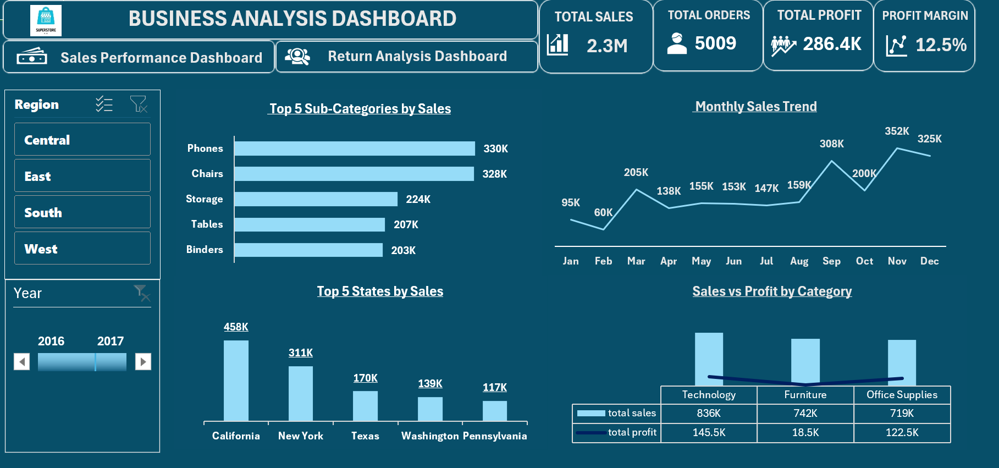

#  RETAIL SALES & RETURNS ANALYSIS DASHBOARD | EXCEL PROJECT

---

#  OBJECTIVE

To analyze retail sales and return performance using interactive Excel dashboards and provide actionable business insights for better business decision-making.

---
# 📌 TABLE OF CONTENTS

- [Project Overview](#project-overview)  
- [Problem Statement](#problem-statement)  
- [Dataset](#dataset)  
- [Tools & Technologies](#tools--technologies)  
- [Methods & Steps Performed](#methods--steps-performed)  
- [Dashboard](#dashboard)  
- [Business Insights & Key Findings](#business-insights--key-findings)  
- [Business Recommendations](#business-recommendations)  
- [How to Run This Project](#how-to-run-this-project)  
- [Result & Conclusion](#result--conclusion)  
- [Author & Contact](#author--contact)

---
#  PROJECT OVERVIEW

This project analyzes the **Sample Superstore retail dataset** using Microsoft Excel to transform raw transactional data into meaningful business insights.
Two interactive dashboards were created:
- **Sales Performance Dashboard**  
- **Return Analysis Dashboard**
 
These dashboards help visualize sales trends, profitability, regional performance, and return behavior in an easy and structured format.

---
#  PROBLEM STATEMENT

Retail businesses generate huge amounts of data daily, but without analysis it is difficult to understand:
- Which categories and products drive the most revenue  
- Which regions perform best  
- When sales peak during the year  
- Why profit margins are low in some areas  
- Where and why product returns are happening  

This project solves these problems by building structured and interactive Excel dashboards for data-driven decisions.

---
#  DATASET

**Dataset Used:** Sample Superstore Dataset  
**Domain:** Retail / E-Commerce  
**Data Type:** Transactional Sales Data  

The dataset includes:

- Order details  
- Sales and profit values  
- Product categories and subcategories  
- Regional and customer information  
- Product return details  

The dataset was already clean and structured, so no additional transformation was required.

---
#  TOOLS & TECHNOLOGIES

- Microsoft Excel  
- Power Query  
- Power Pivot  
- Pivot Tables  
- DAX (Data Analysis Expressions)  
- Charts and Slicers  

---
#  METHODS & STEPS PERFORMED

The following workflow was followed:

1. Imported dataset into Excel  
2. Verified data quality (already clean)  
3. Created relationships using Power Pivot  
4. Built DAX measures  
5. Created Pivot Tables  
6. Designed interactive dashboards with:
   - KPIs  
   - Charts  
   - Slicers  
7. Implemented **dynamic page navigation**  
8. Generated business insights  

---

#  DASHBOARD

---

##  SALES PERFORMANCE DASHBOARD

### Includes Visuals:

- KPIs: Total Sales, Orders, Profit, Profit Margin  
- Top 5 Subcategories by Sales  
- Monthly Sales Trend  
- Top 5 States by Sales  
- Sales vs Profit Comparison  
- Interactive slicers  
- Dynamic page navigation  

---

##  RETURN ANALYSIS DASHBOARD

### Includes Visuals:

- KPIs: Customers, Orders, Returns, Return Rate  
- Top Returned Products  
- Return Rate by Region  
- Return Rate by Ship Mode  
- Return Rate by Category  
- Interactive slicers  
- Navigation to Sales Dashboard  

---

#  BUSINESS INSIGHTS & KEY FINDINGS

---
##  SALES ANALYSIS INSIGHTS

### Top Performing Categories

- **Technology – Sales: 836K, Profit: 145.5K**  
- **Furniture – Sales: 742K, Profit: 18.5K**
 
 Furniture has high sales but very low profit compared to Technology, indicating a major profitability issue.

---

### Best Performing Subcategories
- **Phones: 330K | Chairs: 328K**
 
 Phones and Chairs are the biggest revenue drivers.

---
### Top Performing States

- **California: $458K | New York: 311K | Texas: 170K**
 
These three states generate **approximately one-third of total revenue**, making them critical markets.

---
### Sales Trend Observation

- Peak sales occur between **September to December**  

Clear seasonal demand toward year-end.

---
##  RETURN ANALYSIS INSIGHTS

### Returns by Region

- **West Region contributes more than half of total returns**

 This region needs immediate operational focus.

---
### Returns by Ship Mode

- **Same-Day and First-Class shipping have the highest return rates**

 Faster delivery options face more fulfillment issues.

---
### Returns by Products

- Some products repeatedly appear in return lists

 Indicates possible quality problems, description mismatch, or customer expectation gaps.

---
#  BUSINESS RECOMMENDATIONS
---
## 1. Improve Furniture Profitability
- Review pricing strategies  
- Reduce excessive discounts  
- Optimize supply chain costs  
- Analyze margin structure  

---
## 2. Leverage Peak Sales Months
- Plan promotions for Sep–Dec  
- Increase inventory before peak season  
- Strengthen marketing campaigns  
- Improve logistics planning  

---
## 3. Reduce West Region Returns
- Investigate root causes  
- Improve packaging and quality checks  
- Monitor customer feedback  

---
## 4. Improve Fast Shipping Operations
- Strengthen pre-dispatch quality checks  
- Improve packing standards  
- Reduce rushed order errors  
---

#  HOW TO RUN THIS PROJECT
- Download and open the Excel dashboard file  
- Click **Enable Content** if prompted  
- Use slicers to filter data dynamically  
- Navigate between dashboards using **page navigation buttons**  
- Fully interactive user experience  

---

#  RESULT & CONCLUSION
This project successfully transformed raw retail data into structured dashboards that help to:

- Understand sales performance clearly  
- Identify profitable and non-profitable areas  
- Recognize seasonal trends  
- Analyze return behavior  
- Support data-driven decision making  

The dashboards provide actionable insights to improve revenue, profitability, and operational efficiency.

---

#  AUTHOR & CONTACT

**Name:** Shaily Gupta  
**Email:** shailygupta2529@gmail.com  
**LinkedIn:** https://www.linkedin.com/in/shailygupta05/

---

###  THANK YOU FOR VISITING THIS PROJECT!
